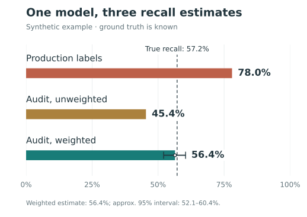
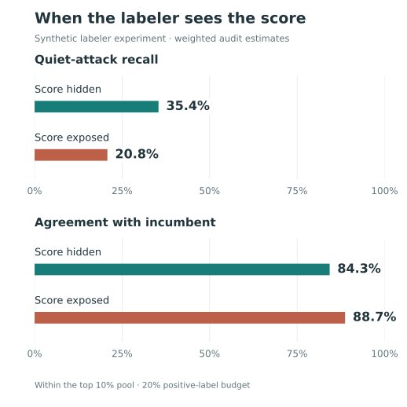

::: {.lead}
In the simulation below, a new account-takeover detector appears to catch **78% of attacks**. Measured against every attack, it catches **57%**. The detector has not changed. The labels have.
:::

Recall is the share of actual attacks a detector catches. That sounds straightforward—until we ask how an attack becomes an “actual attack” in the dataset.

In production, an investigation might begin because the existing detector flagged a suspicious login. A customer report or account recovery might confirm a compromise later. Those paths produce useful evidence, but they do not reach every attack. An attack that attracts no attention may never receive a label at all.

When we evaluate the next detector on those labels, we can mistake coverage of *known attacks* for coverage of *all attacks*. And when we train on the same data, that gap can shape what the next detector learns.

> A detector helps decide which attacks become visible. Its successor inherits that view of the world.

I built a [small simulator](#simulator) to make this problem visible. All results here are synthetic: we know which logins are attacks, including the ones the labeling process misses. The examples illustrate mechanisms, not measured performance in a production system.

## The attacks that never become labels {#labels-are-selectively-observed}

Imagine two kinds of account takeover:

- **Loud attacks** arrive in bursts, with high request rates and familiar signs of automation.
- **Quiet attacks** move slowly. Device novelty and implausible geography provide clues, but their request rates look ordinary.

The existing detector—the *incumbent*—relies on request rate. In this simulated population, it flags **88.7% of loud attacks** and just **6.4% of quiet attacks**. Every flagged event receives a correct label. The investigators make no mistakes; the gap comes from which events reach them.

Of **15,831 attacks**, the incumbent surfaces **8,182**. A small random audit finds another **370** that the incumbent missed. That leaves **7,279 attacks** unresolved.

The simulated data pipeline records those unresolved events as negative. That is a consequential assumption: *nobody investigated it* becomes *it was benign*. A pipeline that leaves such events unlabeled avoids this particular error, but its labeled dataset still underrepresents attacks the detector misses.

This is the problem of **selective labels**: the process that decides what to investigate also determines what we can learn from the resulting data.

## One detector, three answers {#the-same-model-can-appear-to-have-very-different-recall}

Now evaluate a candidate detector that uses device and geography signals as well as request rate. Hold its predictions fixed and change only how recall is measured.

{#fig-recall fig-alt="Recall is 78.0% using production labels, 45.4% in the unweighted audit, and 56.4% in the weighted audit. True recall is 57.2%. The weighted estimate's approximate 95% bootstrap interval is 52.1% to 60.4%."}

The production-label estimate is **20.8 percentage points too high**. Its denominator contains attacks that were discovered, overwhelmingly through the incumbent's checks. It answers: *Of the attacks our existing process found, how many would this candidate flag?*

That is a useful question. It is also a narrower question than overall recall.

The bias is optimistic in this example because the candidate does well on the attacks the incumbent surfaces. For another candidate, the bias could point the other way. Collecting more data through the same selection process does not, by itself, correct either bias.

The audit estimates tell the rest of the story. Random sampling reaches attacks outside the incumbent's view, but sampling different groups at different rates changes the mix. Correcting for those rates brings the estimate from **45.4% to 56.4%**, close to the true **57.2%**. We will unpack that correction below.

## How blind spots reach the next model {#why-this-affects-training-not-just-metrics}

The same labels often feed both evaluation and training. If discovered attacks are positive and undiscovered attacks are negative, a model is rewarded for reproducing part of the incumbent's behavior. A feature that identifies a missed attack may even be penalized, because the training label says the event was benign.

Once deployed, that model helps choose which events get investigated next. The cycle can repeat:

::: {.feedback-loop aria-label="Feedback cycle: detector, investigations, labels, next detector, then more investigations."}
**Detector** → investigations → labels → **next detector**
:::

This is a mechanism by which blind spots can persist, not a claim that every successor must reproduce them. New features, customer reports, and other sources of evidence can expand coverage. The simulator itself holds the candidate's scoring rule fixed; it does not train models across generations.

Even this fixed candidate shows why aggregate metrics need context. It catches **79.5% of loud attacks** and **30.0% of quiet attacks**. Compared with the incumbent, it improves quiet-attack coverage while losing some loud-attack coverage. A single recall estimate against production labels cannot explain that tradeoff.

## Build an audit that reaches beyond the detector {#breaking-the-feedback-loop}

The first step is to give unflagged events a chance to be investigated. Randomly select a small sample of traffic, resolve its labels, and record each event's probability of being selected. The incumbent can help define risk groups, but it should not be the only route into the audit.

The simulator samples **5% of lower-risk traffic** and **2% of higher-risk traffic**. Its holdout bypasses enforcement so downstream outcomes can be observed. In production, first establish whether investigation can resolve the label while protections remain in place. Sampling events for review and allowing risky events through are separate decisions.

Unequal sampling creates a second measurement problem. The audit contains proportionally more lower-risk traffic, including quiet attacks the candidate struggles to catch. Simply averaging over audited attacks gives the **45.4%** estimate.

### Let each sampled event represent its share of traffic

An event sampled at a 5% rate represents 20 events. An event sampled at a 2% rate represents 50. These weights let us estimate population counts from the sample.

For audit sample $H$, let $p_i$ be event $i$'s inclusion probability, $Y_i$ be 1 if it is an attack, and $D_i$ be 1 if the candidate flags it. Then:

$$
\widehat{R}
= \frac{\sum_{i \in H} w_i D_i Y_i}{\sum_{i \in H} w_i Y_i},
\qquad w_i = \frac{1}{p_i}.
$$

In words: **estimated attacks caught, divided by estimated attacks present**. This ratio uses inverse-probability weighting.[^weighting]

The probabilities are known because we chose the sampling policy. We do not have to reconstruct them from historical enforcement decisions. In this run, the weighted estimate is **56.4%**, with an approximate **95% bootstrap interval of 52.1%–60.4%**.[^interval]

### What weighting can—and cannot—fix

Weighting corrects unequal sampling. It cannot supply labels for a group that is never sampled, turn unresolved cases into known negatives, or repair incorrect labels. Every group in the target population needs a nonzero chance of observation, and sampled cases need reliable labels.

The target also matters. This simulator measures detection of **malicious attempts**. Measuring **successful compromises** is different: an enforcement action can prevent the outcome you are trying to observe.

Small sampling rates produce large weights, so a few cases can have substantial influence. Choose rates with review cost and precision in mind. If obtaining an outcome requires relaxing enforcement, exposure limits come first—especially on a platform serving young users. Where those limits leave a group unobserved, report the coverage gap.

## When labelers see the model's answer {#a-second-feedback-path-exposing-the-model-score-to-the-labeler}

Selection is one way the detector shapes its labels. Showing a reviewer the detector's risk score is another.

A human or LLM reviewer may have device history, IP reputation, account relationships, and post-login activity. Adding the incumbent's score can help an operational decision. But if the review is meant to provide an independent check on that detector, the score introduces a direct path for its judgment to influence the label.

The simulator explores this with programmed annotators. One uses the case evidence alone; another is explicitly designed to lean toward the incumbent's score when uncertain. This is an illustration of score dependence, not an experiment on real humans or LLMs.

Both annotators label **20% of the same review pool** as attacks. The pool is the risk-screened **top 10% of traffic**, not the full population. The following results are weighted audit estimates within that pool:

| Annotator metric | Score hidden | Score exposed |
|:--|--:|--:|
| Agreement with incumbent | 84.3% | 88.7% |
| Recall across attacks in the pool | 73.5% | 69.4% |
| Recall on loud attacks | 92.7% | 93.9% |
| Recall on quiet attacks | **35.4%** | **20.8%** |

{#fig-labelers fig-alt="With the score exposed, estimated agreement with the incumbent rises from 84.3% to 88.7%, while estimated recall on quiet attacks falls from 35.4% to 20.8%."}

The exposed annotator agrees more with the incumbent while finding fewer of the quiet attacks it misses. At the same positive-label budget, estimated quiet-attack recall falls by **14.6 percentage points**.

### Agreement is not ground truth

The simulator also compares the score-hidden annotator with a separate, simulated human reviewer. Their agreement barely changes between the incumbent-selected sample and the weighted audit: **88.0% versus 87.9%**. Yet the annotator's recall against simulated truth is **93.1% on the selected sample** and an estimated **73.5% in the review pool**.

The annotator has not changed. The evaluation population has. Agreement alone does not reveal that the broader pool is harder, and two reviewers can agree while sharing the same mistakes.

For an independent audit, hide the incumbent's score and decision, including obvious proxies in the case summary. Blinding removes this direct source of influence; it does not guarantee independent errors. Reviewers may still share evidence, instructions, or blind spots.

## What I would change in production {#what-i-would-do-in-practice}

I would start with four changes to the labeling pipeline:

1. **Keep “unknown” distinct from “benign.”** Record how each label was obtained: what triggered review, what evidence resolved the case, and when the outcome became available. Preserve unresolved cases as unresolved.
2. **Maintain a random audit across risk groups.** Include unflagged traffic, log inclusion probabilities, and track unresolved audit cases. Report weighted estimates with uncertainty and make gaps in coverage explicit.
3. **Break out performance by attack pattern.** Aggregate recall can conceal a detector that improves on familiar attacks while missing a growing segment. Use patterns supported by the evidence; the simulator's clean “loud” and “quiet” labels will not always exist in production.
4. **Separate operational review from independent evaluation.** Scores may help reviewers act, but an audit needs evidence that can challenge the detector's judgment. Use blinded review and check more than reviewer agreement.

Label generation is part of the detection system. Improving it gives the next model a better chance to learn something the current model does not know.

**Before trusting a recall estimate, ask how an attack enters its denominator—and which attacks have no way in.**

## Reproduce the examples {#simulator}

The code is in [labels-are-estimators](https://github.com/qianrongwu/labels-are-estimators). From a checkout, install the dependencies and run both examples:

```bash
python -m pip install -r requirements.txt
python demo.py
python demo_labelers.py
```

The reported values use the default `Config`: 800,000 sessions, 2% attack prevalence, a 45% quiet share among attacks, and random seed 7. The candidate flags 2% of traffic. The article's charts redraw the simulator's results with simpler labels.

To explore the mechanism, vary `p_quiet`, `gate_threshold`, `holdout_rate_low`, and `holdout_rate_high` in `simulate.py`. Compare the estimation error and interval width across multiple seeds. The size—and sometimes the direction—of the error depends on the attack mix, the detectors, and the sampling policy.

[^weighting]: The formula is a ratio of Horvitz–Thompson estimates of totals, sometimes called a Hájek-style estimator. Each total is unbiased under the sampling design when inclusion probabilities are positive and labels are correctly observed. Their ratio is generally not exactly unbiased, though it is consistent under standard regularity conditions. See [Statistics Canada's treatment of Horvitz–Thompson and Hájek estimators](https://www150.statcan.gc.ca/n1/pub/12-001-x/2016001/article/14540/03-eng.htm).

[^interval]: The simulator takes 400 bootstrap resamples of the observed attacks in the audit and uses the 2.5th and 97.5th percentiles. This is an illustrative interval for the fixed candidate; it does not capture label errors, model training uncertainty, or changes in future traffic.
