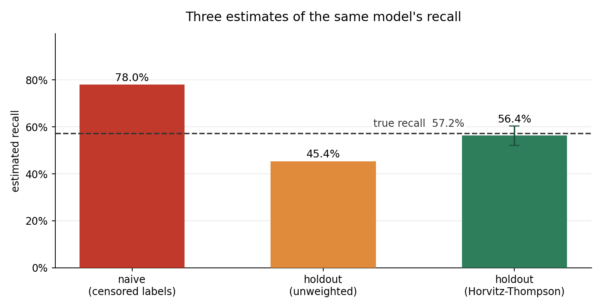

Detection models are usually trained on historical labels.

In adversarial systems, those labels are rarely neutral.

Consider account takeover detection. A login attempt may become a confirmed positive because the existing system challenged it, the challenge failed, the user later recovered the account, or support confirmed the compromise.

But what about an attack the existing detector never noticed?

Often, nothing happens. No challenge, no review, no recovery signal. The event remains unlabeled—or worse, is treated as negative.

This creates a simple but important problem:

> The system deciding what to inspect is also shaping the data used to train its successor.

The result is a feedback loop: detectors tend to inherit the blind spots of the systems that generated their labels.

## Labels are selectively observed

Let $Y$ denote whether an event is truly malicious and $S$ whether the existing system selects it for inspection.

In many production pipelines, we observe $Y$ reliably only when $S = 1$.

The problem is that selection is not random:

$$P(S = 1 \mid X, Y) \neq P(S = 1)$$

The incumbent detector selects examples using features $X$ that are themselves correlated with maliciousness.

So the missing labels are **missing not at random**.

This matters even if the labeling process after selection is perfect.

Imagine two kinds of account takeover:

- **Loud attacks:** high velocity, repeated IPs, obvious automation.
- **Quiet attacks:** low velocity, novel devices, unusual geography, but otherwise normal behavior.

Suppose the incumbent detector was built mostly around velocity. In a simulation, it catches:

- **88.7%** of loud attacks
- **6.4%** of quiet attacks

There are 15,831 true attacks in total.

Only 8,552 become observed positives. The remaining **7,279 attacks are never surfaced by the incumbent and therefore look benign in the training data.**

That is already enough to distort evaluation.

## The same model can appear to have very different recall

Suppose a candidate model has true recall of **57.2%**.

Evaluate it using the production labels generated above, and estimated recall becomes:

| estimator | estimated recall |
|---|---|
| existing warehouse labels | 78.0% |
| sampled holdout, unweighted | 45.4% |
| sampled holdout, weighted | 56.4% |
| true recall | 57.2% |

The first estimate is not merely noisy. It is systematically optimistic.

Its denominator is effectively:

> attacks the existing system already knows how to find

rather than:

> all attacks

More production traffic does not fix this. With enough data, the biased estimate simply becomes more precise.

## Why this affects training, not just metrics

If this only corrupted a dashboard, we could add a warning label and move on.

But the same data is usually used for training.

The model sees detected attacks as positives and many undetected attacks as negatives. It therefore learns a decision boundary that resembles the incumbent detector.

In the same simulation, the candidate model detects:

- **79.5%** of loud attacks
- **30.0%** of quiet attacks

Yet evaluation against incumbent-generated labels largely hides this difference.

After deployment, the new model determines which examples become visible in the next round of data.

The loop becomes:

$$\text{detector} \rightarrow \text{selection} \rightarrow \text{labels} \rightarrow \text{next detector}$$

Without an independent source of labels, blind spots can persist across model generations.

## Breaking the feedback loop

The cleanest solution is conceptually simple:

> Randomly observe a small amount of traffic independently of the detector.

For that traffic, allow downstream outcomes or manual investigation to establish the label.

This produces a sample in which label availability is determined by a known sampling policy rather than by the incumbent detector.

In security systems, uniform sampling is often impractical. Allowing high-risk traffic through is more expensive than allowing low-risk traffic through.

So suppose we sample different risk groups at different rates.

Then a plain average over the holdout is still biased, because its attack mix no longer matches the population's. In the simulation that error is about the same size as the one we just removed, pointing the other way.

Record the inclusion probability $p_i$ for every sampled event and define

$$w_i = \frac{1}{p_i}.$$

Then estimate recall with

$$\widehat{R} = \frac{\sum_{i \in H} w_i \, \text{pred}_i \, Y_i}{\sum_{i \in H} w_i \, Y_i}.$$

This is inverse-probability weighting, or a Horvitz–Thompson style estimator.

The important part is that $p_i$ **is known because we chose it.**

We are correcting for a sampling decision we control, rather than trying to model an unknown adversarial selection mechanism after the fact.

In the simulation:

- unweighted holdout recall: **45.4%**
- weighted holdout recall: **56.4%**
- true recall: **57.2%**

The tradeoff is variance. Small sampling probabilities create large weights, which widen confidence intervals.

So the practical design problem becomes:

> How much unbiased measurement can we afford?

That is a much healthier problem than unknowingly optimizing against biased labels.

It is also not only a statistical question. On a platform serving young users, holdout exposure has to be capped, guardrailed, and reviewed, and those limits bind before the variance calculation does.

## A second feedback path: exposing the model score to the labeler

There is another, easier-to-fix source of dependence.

Suppose an LLM or human annotator receives a rich case summary:

- device history
- IP reputation
- account graph
- post-login activity
- geolocation

and also receives the incumbent model's risk score.

The score is informative, so including it seems reasonable.

But now the labeler is no longer independent of the detector being evaluated.

In a simulation, exposing the score increases agreement with the incumbent:

| | score hidden | score exposed |
|---|---|---|
| agreement with incumbent | 84.3% | 88.7% |
| recall vs. truth | 73.5% | 69.4% |
| recall on loud attacks | 92.7% | 93.9% |
| recall on quiet attacks | 35.4% | 20.8% |

Agreement improves.

Actual coverage gets worse.

The largest loss appears exactly where independent labeling is most valuable: attacks the incumbent already struggles to detect.

This is not a failure of a poorly built model. It is what a careful reasoner does with an authoritative-looking number in front of it, which is why using a stronger model does not remove the effect.

This also shows why **human–LLM agreement alone is not enough to validate a labeler**.

Two labelers can agree because they share the same source of bias.

The simulation makes that concrete. Measured on the incumbent-selected sample, the annotator agrees with the human labeler 88.0% of the time. Measured on the independent holdout, 87.9%. Its actual recall against truth across those two samples is 93.1% and 73.5%.

Agreement does not move. The quantity it stands in for moves by a fifth.

If the goal is independent evidence, hide the incumbent score.

## What I would do in practice

For a production detection system, I would start with four things.

**1. Document label provenance.**
For every positive label, record why it exists: which enforcement action surfaced it, which downstream signal confirmed it, and what had to happen for the event to become observable.

**2. Measure performance by attack segment.**
Aggregate recall can hide large coverage gaps. If the dataset cannot support meaningful segmentation, that itself is useful evidence about label coverage.

**3. Create a small independent holdout.**
Stratify it, cap exposure, add safety guardrails, and log the inclusion probability for every sampled event.

**4. Keep incumbent scores out of independent labeling.**
Especially when using LLM-assisted review. The purpose of an independent labeler is to add information, not reproduce the current model's belief.

None of these requires a more sophisticated detector.

They require treating **label generation as part of the ML system**.

## Simulator

The examples above are synthetic because production data rarely contains the latent truth needed to measure this bias directly.

I built a small simulator that makes the full data-generating process observable:

[github.com/qianrongwu/labels-are-estimators](https://github.com/qianrongwu/labels-are-estimators)

It runs in about thirty seconds. The knobs worth turning are in `Config`.

Push the two holdout rates apart and watch the weighted estimate stay centered while its interval widens.

Raise the share of quiet attacks and watch the warehouse-label estimate grow more confident as it grows more wrong.
