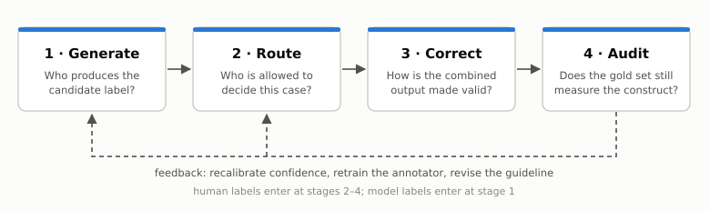
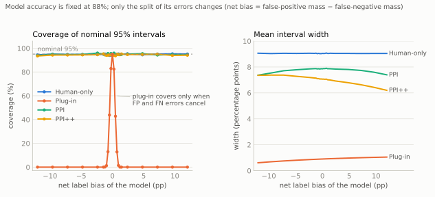
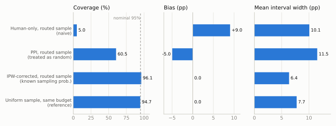

Model-assisted annotation serves several goals: assigning labels to individual items, training downstream models, and estimating population quantities. These uses need different checks. A model can do well on a classification benchmark and still produce a biased estimate of prevalence.

Consider two classifiers that each make 120 errors on 1,000 items. One makes 60 false positives and 60 false negatives; the other makes 90 and 30. Both are 88% accurate, but their estimated prevalences differ from the reference prevalence by zero and by +6 percentage points. Classification error depends on the *sum* of the two error masses; prevalence error depends on their *difference*.

This post organizes annotation around four stages: **generate** candidate labels, **route** items to an appropriate judge, **correct** estimates using human labels, and **audit** the reference labels themselves. The connection I care most about is between routing and correction: the rule that selects which items receive human review also determines what can be estimated from that review. The four-stage framing and that argument are my own reading of the literature. Claims about individual papers are attributed to them, and places where I go beyond a paper are marked.

## Task-specific validation

Annotation quality depends on the model, the data distribution, and the label definition together. Validation on one task is limited evidence for another, even when both use familiar categories such as toxicity or preference.

Pangakis et al. [1] replicated 27 annotation tasks from social-science articles. Median accuracy was 0.85 and median F1 was 0.71, but precision or recall fell below 0.5 on nine of the tasks. Aggregate performance concealed large task-level variation, and the authors recommend validating on the exact task, dataset, and guideline in use.

Prompting can move a model toward a task definition, and in the one study I know that measures how far, the movement was partial. In a toxicity-annotation study across nine models and five datasets, Casanova et al. [2] report an overall rescue rate of 34.8%: the share of zero-shot errors corrected by prompting, pooled over prompting conditions that include definitions which do not match the dataset's own. The rate fell to 20.8% for errors made with confidence above 0.9. Supplying the matching definition raised accuracy by 2.2 points on average. Persistent disagreement calls for looking at the examples and the definition before choosing between more prompting, fine-tuning, or human annotation. Revising the definition is a legitimate option, with the caveat that it changes the measurement target.

## Structured judge errors

Errors can depend systematically on features unrelated to the intended judgment. Two well-studied cases are candidate position and response length. One paper shows how to measure such a dependence without human labels; the other shows how to adjust for it once it has a name and a covariate.

### Position

Shi et al. [3] show the same candidates to a judge under swapped and permuted orders, for 15 judges and more than 150,000 judgments on MTBench and DevBench. They separate quantities that are often reported as one. *Repetition stability* asks whether the judge repeats its verdict on an identical prompt. *Position consistency* asks whether it chooses the same candidate after the candidates are permuted. A third metric, *preference fairness*, summarizes which way the order-dependence leans.

Repeated judgments were generally stable, so the inconsistency under permutation is not sampling noise. Position consistency varied widely across judges, and it rose with the apparent quality gap between the answers being compared: close comparisons were the ones most sensitive to order.

Swapping the order therefore gives a useful abstention signal. My reading is that this changes what the standard mitigation accomplishes. An inconsistent verdict identifies an order-sensitive comparison; it does not establish which candidate is better. Keeping only consistent verdicts converts close pairs into ties or abstentions, and escalating those pairs to people produces a review sample that was selected for being hard. That is the situation the routing section takes up.

### Length

Dubois et al. [4] model the judge's preference for model $m$ over baseline $b$ on instruction $x$ with a logistic regression whose linear predictor has three terms:

$$
\begin{aligned}
\eta \;=\;& \underbrace{\theta_m - \theta_b}_{\text{model}}
\;+\; \underbrace{(\psi_m - \psi_b)\,\gamma_x}_{\text{instruction difficulty}} \\[4pt]
&+\; \underbrace{\phi_{m,b}\,\tanh\!\left(\frac{\operatorname{len}(z_m) - \operatorname{len}(z_b)}{\operatorname{std}(\operatorname{len}(z_m) - \operatorname{len}(z_b))}\right)}_{\text{length}} .
\end{aligned}
$$

The length-controlled win rate is the model's prediction with the length term set to zero, averaged over instructions. The form is chosen so that the result is still a win rate: a model against itself scores 50, and swapping the two models gives the complement.

The length coefficient is weakly regularized, for a reason worth noticing. Without it, a model could be truncated on exactly the instructions it handles badly, and the regression would attribute those losses to shortness and adjust them away.

Prompting the same model to be concise or verbose moved its raw win rate from 22.9% to 64.3%; the length-controlled figure moved from 41.9% to 51.6%, and Spearman correlation with Chatbot Arena rose from 0.94 to 0.98. The adjustment estimates preference at equal length. Its interpretation depends on treating length as a nuisance variable, and, as the authors say, it does nothing for biases that have not been modeled.

Other documented cases include rubric-order effects in pointwise judging [5], preference leakage between related generator and judge models [6], and compression toward the middle of clinical ordinal scales [7]. These errors are structured, and more model labels do not guarantee that their effect on the quantity of interest disappears. They can cancel in one aggregate and distort another, as in the opening example, so their consequences have to be evaluated for the target quantity and cannot be read off overall accuracy.

## Routing: two objectives

Human review can improve the reliability of individual decisions, or the precision of a population estimate. The two objectives lead to different routing policies, and the difference matters later.

### Selective judgment

Jung et al. [8] start from a judge $f_{\text{LM}}$ with a confidence score $c_{\text{LM}}$ and let it answer only above a threshold $\lambda$; otherwise it abstains. Given an acceptable disagreement rate $\alpha$ and a failure probability $\delta$, the method looks for a threshold such that, with probability at least $1-\delta$ over the calibration sample,

$$
P\bigl(f_{\text{LM}}(x) = y_{\text{human}} \,\big|\, c_{\text{LM}}(x) \ge \lambda\bigr) \;\ge\; 1 - \alpha .
$$

*How the threshold is chosen.* On human-labeled calibration data, compute the empirical disagreement rate among the items the judge would keep at threshold $\lambda$, and an exact binomial upper confidence bound on it. Test thresholds in a prescribed order, from strict to loose, stop at the first one whose bound exceeds $\alpha$, and use the last threshold that passed. Because the order is fixed in advance and the scan stops at the first failure, no multiple-testing correction is needed (fixed-sequence testing).

*A point that is easy to get backwards.* A stricter threshold may lower the true risk of the kept set, but it also leaves fewer calibration items with which to certify that risk. With no errors among five kept items, a one-sided 95% binomial upper bound on the risk is still about 45%; with thirty, it is about 9.5%. Coverage is therefore found from data. The guarantee, as proved in the paper, assumes the calibration items are an i.i.d. sample from the deployment distribution; it does not extend to a deployment distribution that has drifted.

*Where the confidence comes from.* The paper reports that token probabilities and verbalized confidence are poorly calibrated for this purpose. Its alternative, Simulated Annotators, calls the same model several times, each with a different set of few-shot examples standing in for a different human rater, and uses the agreement among the simulated raters as the confidence. With GPT-4-turbo on AlpacaEval this gives an expected calibration error of 0.095, against roughly 0.22 for the other two. A cascade then hands each item to the cheapest judge whose confidence clears its own calibrated threshold, and abstains if none does. On a Chatbot Arena subset where GPT-4 alone rarely reaches 80% human agreement, the authors report over 80% agreement at almost 80% coverage, with most kept items judged by smaller models.

The guarantee concerns the kept set. It says nothing about the abstained items, which are the ones that go to people.

### Sampling for estimation

Gligorić et al. [9] ask a different question. The goal is a population quantity with a valid interval: a prevalence, an odds ratio, a regression coefficient. Every item has an LLM annotation $\hat H_i$ and a verbalized confidence $C_i$; a limited number can also receive a human annotation $H_i$. The method chooses a *sampling rule* and not a threshold. For a mean, item $i$ is reviewed with probability

$$
\pi_i \;\propto\; \sqrt{\widehat{\text{err}}(C_i)}, \qquad \sum_{i}\pi_i = n_{\text{human}},
$$

where $\widehat{\text{err}}(C)$ predicts the squared model–human disagreement from the confidence score, and is refit in batches on the human labels collected so far.

*Why a square root.* For mean estimation, the variance contributed by an inverse-probability-weighted correction is, up to constants, $\sum_i e_i^2/\pi_i$, with $e_i^2$ the expected squared residual of item $i$. Minimizing it under a fixed budget $\sum_i \pi_i$ gives $\pi_i \propto e_i$, the root mean squared residual, by the Cauchy–Schwarz inequality. The argument has the same form as Neyman allocation in survey sampling. For other targets the rule changes: for a regression coefficient, the paper multiplies by a term that reflects each item's influence on the coefficient of interest.

On three computational social science tasks with GPT-4o annotations, the authors report valid intervals with over 25% fewer human annotations than human-only estimation on each task, while intervals built from LLM annotations alone covered poorly.

### Two routers, one signal

Both methods route on model confidence. They arrive at different policies because they optimize different things.

| | Selective judgment [8] | Sampling for estimation [9] |
|---|---|---|
| Target | Agreement with humans on the kept items | Precision of a population estimate |
| Policy | Deterministic: keep if confident, else escalate | Randomized: review with known probability $\pi_i$ |
| Low-confidence items | All escalated | Reviewed more often |
| High-confidence items | Never seen by a human | Reviewed rarely, but with $\pi_i > 0$ |
| The human labels are | A selected sample of hard cases | A probability sample with known weights |

: **Table 1.** The comparison is mine. {.striped}

The row I would underline is the fourth. A deterministic cascade never shows a person the cases the model is confident about, so it cannot detect confident errors, and in [2] high-confidence errors were the ones least often rescued by prompting. There is some evidence that they become more common under LLM supervision: in a hate-speech study discussed below [15], the share of classifier errors made with confidence above 0.90 rose from 2–14% with human training labels to 11–30% with GPT-5.2 labels. A production system can have both properties by running the cascade for decisions and adding a small random audit, with logged probabilities, over everything the cascade auto-accepts. The simulation below shows what is lost without it.

## Correction

Let $f(X)$ be a model prediction, $Y$ a human label, and $\theta = \mathbb{E}[Y]$ the target. Consider two independent samples from the same population: $N$ prediction-only items $\tilde X_i$ and $n$ labeled items $(X_j, Y_j)$, with the predictor fixed independently of these labels. The tempting estimator averages the model's predictions. It is precise and, in general, centered on the wrong value.

### Prediction-powered inference

For a mean, PPI [10] adds a correction estimated from the human sample:

$$
\hat\theta_{\text{PPI}} \;=\; \underbrace{\frac{1}{N}\sum_{i=1}^{N} f(\tilde X_i)}_{\text{model predictions}} \;+\; \underbrace{\frac{1}{n}\sum_{j=1}^{n}\bigl(Y_j - f(X_j)\bigr)}_{\text{rectifier}} .
$$

*Intuition.* The rectifier estimates the model's average error and removes it. Nothing is assumed about the accuracy of $f$.

*Consequence.* Under independent sampling the variance is $\operatorname{Var}(f)/N + \operatorname{Var}(Y - f)/n$. When the first term is negligible, PPI is more precise than the human-only mean exactly when $\operatorname{Var}(Y-f) < \operatorname{Var}(Y)$. The predictor supplies efficiency; the human sample identifies the correction.

PPI++ [11] adds a weight on the model term. (This $\lambda$ is a model weight, unrelated to the routing threshold above.)

$$
\hat\theta_{\lambda} \;=\; \frac{1}{n}\sum_{j=1}^{n} Y_j \;+\; \lambda\left(\frac{1}{N}\sum_{i=1}^{N} f(\tilde X_i) - \frac{1}{n}\sum_{j=1}^{n} f(X_j)\right),
$$

with the weight estimated as

$$
\hat\lambda = \frac{\widehat{\operatorname{Cov}}(Y, f)}{(1 + n/N)\,\widehat{\operatorname{Var}}(f)} .
$$

This is a control-variate estimator: $\lambda = 1$ recovers PPI and $\lambda = 0$ recovers the human-only mean, so an unhelpful predictor is down-weighted. The efficiency guarantee for the estimated weight is asymptotic.

### Correction under selective sampling

The unweighted rectifier is biased when human review depends on model confidence. Design-based supervised learning [12] treats labeling as a sampling design. For a pool of $N$ items, let $R_i$ indicate human review and let $\pi_i > 0$ be its known probability. In the mean case the idea reduces to a pseudo-outcome:

$$
\tilde Y_i \;=\; f(X_i) + \frac{R_i}{\pi_i}\bigl(Y_i - f(X_i)\bigr),
\qquad
\hat\theta_{\text{DSL}} = \frac{1}{N}\sum_{i=1}^{N}\tilde Y_i .
$$

*Intuition.* The design expectation of $R_i/\pi_i$ is one, so the weighted residual is an unbiased correction whatever $f$ is, provided the predictions are fixed independently of the sampled labels. Readers from causal inference will recognize the augmented inverse-probability-weighted form with a known propensity; with $f \equiv 0$ it is the Horvitz–Thompson estimator I used in [an earlier post on selective labels](https://qianrongwu.com/posts/detectors-inherit/).

*Consequence.* Validity comes from the design and not from the model; the model affects only efficiency. Confidence-driven inference [9] is this estimator with $\pi_i$ chosen from model confidence and a tuned model weight. Setting that weight to zero gives a *weighted* human-only estimator under the same design. It protects against an unhelpful model; it does not by itself guarantee an improvement over uniform human sampling.

Two qualifications. Known positive probabilities establish the point correction, not finite-sample coverage: normal-approximation intervals need a design-appropriate variance estimate and regularity conditions, and very small probabilities produce unstable weights. And a predictor fitted on the audit labels needs sample splitting or cross-fitting.

## Simulation

Two experiments look at error asymmetry and at selective review. Both estimate a prevalence with nominal 95% normal-approximation intervals, $N = 30{,}000$ model-labeled items, a human budget of 300, and 2,000 replications. The target in both is the population prevalence, not the realized mean of a pool. Code, seeds, data-generating processes, and saved outputs for both experiments and for the diagnostic below are in the [companion code folder](https://github.com/qianrongwu/qianrongwu.github.io/tree/main/posts/model-assisted-annotation/_code).

### Fixed accuracy, varying error asymmetry

Experiment A fixes prevalence at 20% and model accuracy at 88%, and varies only how the 12% of errors divide between false positives and false negatives. The 300 labeled items and the 30,000 prediction-only items are drawn independently, as in the PPI setup above.

Model-only intervals are narrow, 0.6–1.1 percentage points (pp). Their coverage is about 95% at zero net bias, 43% at ±0.5 pp, and close to zero beyond ±1.2 pp. Fixed classification accuracy is compatible with anything from nominal to no coverage of the prevalence.

PPI and PPI++ intervals are 13–31% narrower than the human-only baseline, and coverage stays near nominal: 93.9–95.9% for PPI and 93.4–95.2% for PPI++. This binary setting illustrates the mechanism; the size of the saving should not be expected to transfer to a new task.

PPI++ shows a small negative mean error, about −0.1 pp against a standard error near 1.8 pp. A diagnostic with 20,000 replications per setting locates the cause. With the weight estimated on the same 300 labels used in the estimate, the mean error is −0.07 to −0.23 pp (Monte Carlo standard error about 0.013 pp). With an oracle weight, or a two-fold cross-fitted one, it is between 0.00 and +0.02 pp. Clipping the weight to $[0,1]$ does not explain it. The effect is a finite-sample consequence of estimating the weight and the mean from the same labels, it is about a tenth of a standard error, and it has little influence on coverage.

### Human labels selected by uncertainty

Experiment B uses a latent-score model in which the classifier over-predicts the positive class: prevalence 18.3%, accuracy 88.2%, model-only bias +2.9 pp. In each replication one pool of 30,000 is drawn, and each item is reviewed independently with probability proportional to the model's uncertainty, floored at 0.2%, for an expected 300 human labels. This is a cruder rule than the square-root allocation above, which is enough for the point at hand. Intervals use the standard deviation of the pseudo-outcome divided by $\sqrt{N}$. The uniform reference is the same estimator with $\pi_i = 300/30{,}000$ for every item.

Treating the routed sample as representative biases both the human-only estimate (+9.0 pp, 5% coverage) and the unweighted rectifier (−5.0 pp, 61% coverage). The routed sample has a more negative average residual than the population, so the unweighted correction subtracts too much.

Using the known review probabilities brings the bias to zero and coverage to 96.1% in this run, with a mean interval width of 6.4 pp against 7.7 pp for uniform sampling at the same budget. Routing improves precision once the selection enters the estimator, and damages validity when it does not.

My reading of this result is that routing and correction are coupled, and that the coupling is easy to miss because the two usually live in different parts of a pipeline, owned by different people. The design also needs support everywhere. If confident cases are never reviewed, $\pi_i = 0$ in that region, and no weighting can recover their errors without further assumptions. A random audit of auto-accepted traffic preserves the information that correction needs. It is the same holdout argument as in the selective-labels setting: a system can be measured only on what it lets through to a labeler.

*Limits.* One estimand (a mean), binary labels, stable data, one routing rule and one floor. The experiments also treat human labels as ground truth, which is an assumption outside the statistical guarantee.

## Auditing reference labels

Correction aligns an estimate with the human reference. Whether the result is a valid measurement still depends on what that reference represents. Much of the classical material here (rater agreement and aggregation, models of annotator disagreement, methods for finding mislabeled training examples) is covered in Lilian Weng's *Thinking about High-Quality Human Data* [16], and I do not repeat it.

*Benchmark audits.* ReImageNet [13] reports that about 12% of the original ImageNet-1k labels are incorrect and a third of the images are multilabel; the corrected labels raised top-1 accuracy by up to 1.2 points for supervised models and by 5–6 points for multimodal LLMs, so the original benchmark did not penalize model classes equally. A human inspection of two logic benchmarks [14] found incorrect formalizations in 42.5% of the 275 FOLIO validation instances and 42% of the first 100 MALLS test instances; against the corrected references, the accuracy of three LLMs rose by 11 to 23 points.

*Reliability and validity.* Harvey et al. [17] describe annotation with the vocabulary of measurement theory: a concept is given an explicit definition, an instrument is built (schema, guidelines, interface, choice of annotators), labels are produced, and the result is interrogated for reliability, "whether a measurement can be repeated," and validity, "whether a measurement is correct." Inter-annotator agreement speaks to the first. Annotators, the authors note, "may agree with one another while systematically misinterpreting the concept." The paper separates five sources of annotation issues that look the same in an agreement statistic:

| Source | Definition (quoted) | Response recommended by the paper |
|---|---|---|
| Error | "The annotator did not follow instructions" | Retrain, give feedback, filter annotators |
| Ambiguity | "There is not enough information in the annotation instructions to fully determine the annotation" | Improve instructions, refine the schema |
| Impossibility | "There is not enough information in the data to fully determine the annotation" | Re-process or filter the data |
| Subjectivity | "The annotation depends on implicit values, beliefs, opinions, or assumptions" | Improve instructions, refine the schema |
| Identity | "The identity of the annotator is not aligned with the desired annotator population" | Filter annotators |

: **Table 2.** Adapted from Table 3 of Harvey et al. [17]. {.striped}

The same low agreement calls for different interventions depending on its source. Retraining addresses instruction-following errors and cannot supply missing context; removing disagreement may discard perspectives the task was meant to capture. Two of the paper's recommendations are cheap: record the annotator's certainty with the label, and allow an "impossible to annotate" response, which separates impossibility from ambiguity at collection time. Among validity checks, the annotation-specific reading of discriminant validity is that labels should not encode annotator-specific artifacts unrelated to the construct. Where the target is a distribution of judgments, identity-related variation can be part of the signal.

*A worked example.* Hakimi et al. [15] train hate-speech classifiers on German political TikTok comments with human or LLM labels. Human annotators answered two questions (does the comment refer to immigration, and is the portrayal negative) and agreed only moderately, with Krippendorff's α between 0.43 and 0.49. In the first version of the paper the LLM received a single holistic prompt, and classifiers trained on its labels were strongly skewed toward false positives. In the current version the LLM gets the same two-question decomposition as the humans. At roughly one-tenth of the annotation cost, those labels give better macro-F1 than human labels on three of four encoders, and classifiers trained on them have false-positive to false-negative ratios of 1.86–2.37 (mean 2.15), against 1.86–2.74 (mean 2.13) under human supervision. The holistic prompt, kept as an ablation, gives 2.79–3.72.

My reading is that the revision history makes the point better than either version alone. The ablation indicates that the interface accounts for part of the skew: with the same LLM, moving from the holistic prompt to the two-question decomposition brought the error balance close to the human one, on a task that is ambiguous and subjective to begin with. It does not show that the model contributes nothing. With the same decomposed interface, a second LLM in the study (Qwen3.5) still yields ratios of 2.79–3.39, and all LLM variants over-flag border-control content. The narrower conclusion is that the annotation interface is part of the measurement procedure and belongs in validation along with the model.

Co-annotation adds one more dependency. People tend to adopt a model's suggestion, so a reference sample collected with suggestions visible may reproduce the model's errors, and the corrections of the previous section would inherit them. Independent audit judgments, recorded provenance, and versioned guidelines keep the reference assessable and revisable.

## Open questions

**Calibration under shift.** How quickly do selective guarantees deteriorate under deployment drift, and what evidence should trigger recalibration?

**Audit allocation.** How much random review of auto-accepted traffic is needed for useful intervals, especially for rare errors and small subgroups?

**Disagreement as a target.** A random response from a specified annotator population can itself define $Y$, so correction does not require a unique true label per item. The harder questions are which population is targeted, how to divide a budget between more items and more raters, and how to account for dependence among repeated judgments.

**Judges as reward.** The structured errors above are studied for evaluation. The same judges increasingly act as verifiers and reward signals in reinforcement learning, where a systematic error is optimized against and not only reported. That is the subject of a later post.

## References

1. Pangakis, Wolken, and Fasching. [Automated Annotation with Generative AI Requires Validation](https://arxiv.org/abs/2306.00176). 2023.
2. Casanova, Kocielnik, and Alvarez. [On the Limits of LLM Adaptability: Impact of Model-Internalized Priors on Annotation Task Performance](https://arxiv.org/abs/2606.00467). 2026.
3. Shi, Ma, Liang, Diao, Ma, and Vosoughi. [Judging the Judges: A Systematic Study of Position Bias in LLM-as-a-Judge](https://arxiv.org/abs/2406.07791). 2024.
4. Dubois, Galambosi, Liang, and Hashimoto. [Length-Controlled AlpacaEval: A Simple Way to Debias Automatic Evaluators](https://arxiv.org/abs/2404.04475). 2024.
5. Xu, Hirasawa, Kozuno, and Ushiku. [Am I More Pointwise or Pairwise? Revealing Position Bias in Rubric-Based LLM-as-a-Judge](https://arxiv.org/abs/2602.02219). 2026.
6. Li et al. [Preference Leakage: A Contamination Problem in LLM-as-a-judge](https://arxiv.org/abs/2502.01534). 2025.
7. Zhang et al. [Auditing Multimodal LLM Raters: Central Tendency Bias in Clinical Ordinal Scoring](https://arxiv.org/abs/2605.16386). 2026.
8. Jung, Brahman, and Choi. [Trust or Escalate: LLM Judges with Provable Guarantees for Human Agreement](https://arxiv.org/abs/2407.18370). 2024.
9. Gligorić, Zrnic, Lee, Candès, and Jurafsky. [Can Unconfident LLM Annotations Be Used for Confident Conclusions?](https://arxiv.org/abs/2408.15204) 2024.
10. Angelopoulos, Bates, Fannjiang, Jordan, and Zrnic. [Prediction-Powered Inference](https://arxiv.org/abs/2301.09633). 2023.
11. Angelopoulos, Duchi, and Zrnic. [PPI++: Efficient Prediction-Powered Inference](https://arxiv.org/abs/2311.01453). 2023.
12. Egami, Hinck, Stewart, and Wei. [Using Imperfect Surrogates for Downstream Inference: Design-based Supervised Learning for Social Science Applications of Large Language Models](https://arxiv.org/abs/2306.04746). 2023.
13. Volkov, Kisel, Mishkina, Janouskova, and Matas. [Doomed to Re-Annotate, Forever: The ImageNet Story](https://arxiv.org/abs/2608.13783). 2026.
14. Brunello, Curaba, Geatti, Mignani, Montanari, and Saccomanno. [Fixing FOLIO and MALLS: Verified Annotations and an LLM-assisted Framework to Focus Human Relabeling](https://arxiv.org/abs/2606.02837). 2026 (v2).
15. Hakimi, Hirlimann, Augenstein, and Schütze. [Do We Still Need Humans in the Loop? Human vs. LLM Annotation in Active Learning for TikTok Hate Speech Detection](https://arxiv.org/abs/2604.13899). 2026 (v5).
16. Weng. [Thinking about High-Quality Human Data](https://lilianweng.github.io/posts/2024-02-05-human-data-quality/). Lil'Log, 2024.
17. Harvey, Koenecke, and Kizilcec. [Data Annotation as Measurement](https://arxiv.org/abs/2608.07297). 2026.

::: {.cite-block}
Cited as: Wu, Qianrong. (Sep 2026). "Model-Assisted Annotation: From Labels to Reliable Estimates." qianrongwu.com.
:::
